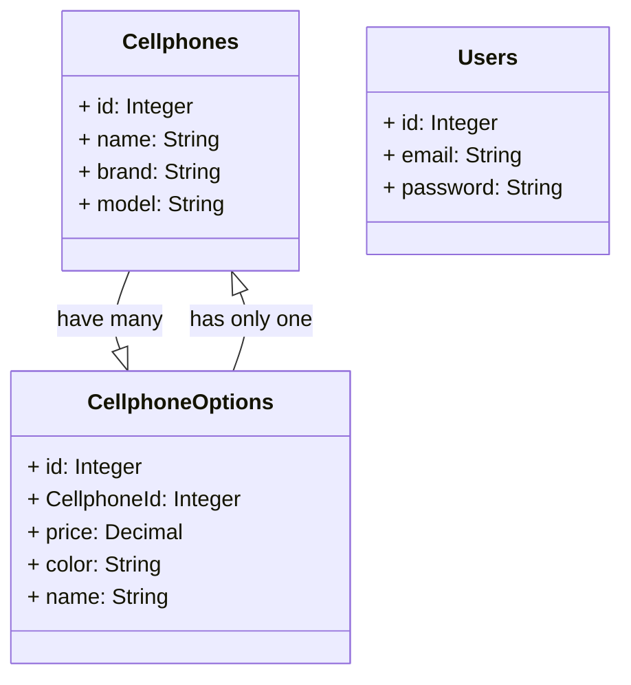

# Desafio Backend: API de Celulares.



## Introdução
Este projeto é uma RESTFul API para uma loja de celulares, feito com Node.js usando o Express.js, Sequelize e Typescript.

Deploy: [API](https://lexart-cellphone-backend.vercel.app/)

### Técnologias utilizadas:
    - Express.js
    - Typescript
    - Sequelize
    - JSON WEB TOKEN
    - Joi
    - Helmet
    - bcrypt
    - Sqlite (ambiente de produção)
    - PostgreSQL (ambiente de produção)
    - Vercel Host

## Configuração do Projeto
1. **Clonar o Repositório:**
   - Clone o repositório para o seu ambiente local.

2. **Instalar Dependências:**
   - No diretório backend, execute o seguinte comando para instalar as dependências:
     ```
     npm install
     ```

3. **Configurar o Banco de Dados:**
   - Certifique-se de que o Postgres esteja configurado corretamente na sua conta Vercel.
   - Renomeie o arquivo `.env.example` para `.env` e defina as variáveis de ambiente para conexão com o banco de dados:
     ```
     POSTGRES_USER=""
     POSTGRES_HOST=""
     POSTGRES_PASSWORD=""
     POSTGRES_DATABASE=""
     DIALECT=""
     NODE_ENV=""
     SECRET=""
     PORT=""
     ```

4. **Rodar as Migrações:**
   - Utilize o Sequelize para rodar as migrações e criar as tabelas no banco de dados:
    ### Linux
     ```
     npm run db-reset
     ```
    ### Windows
    ```
    npm run db-reset-windows
    ```

5. **Iniciar o Servidor:**
   - Execute o servidor localmente com o seguinte comando:
     ```
     npm run dev
     ```
   - O servidor estará disponível em `http://localhost:${PORT}`.

## Rotas da API
Aqui estão as principais rotas da API:

1. **Registro e Login:**
   - `POST /api/user`: Registra um novo usuário e gera um token de autenticação.
   - `POST /api/login`: Realiza o login e gerando um token de autenticação.

    - O token tem duração de 7 dias e usa o algoritmo HS256.

2. **CRUD de Produtos:**
   - `GET /api/cellphone`: Retorna todos os celulares.
   - `POST /api/cellphone`: Cria um novo produto.
   - `PUT /api/cellphone/:id`: Atualiza um produto existente.
   - `DELETE /api/cellphone/:id`: Deleta um produto.

3. **Estruturas Permitidas:**
    - Para adicionar um novo celular, a API aceita qualquer uma das seguintes estruturas:
    ```json
    {
        "name": "Xiaomi Redmi 9",
        "brand": "Xiaomi",
        "model": "Redmi 9",
        "price":  10000,
        "color": "red"
    }
    ```

    ```json
    {
        "name": "Xiaomi Redmi 9",
        "details": {
            "brand": "Xiaomi",
            "model": "Redmi 9",
            "color": "red"
        },
        "price":  10000,
    }
    ```

    ```json
    [
        {
            "name": "Xiaomi Redmi 9",
            "brand": "Xiaomi",
            "model": "Redmi 9",
            "data": [
                {
                    "price": 10000,
                    "color": "red"
                },
                {
                    "price": 10000,
                    "color": "blue"
                }
            ]
        },
        {
            "name": "Iphone 14 Pro",
            "brand": "Iphone",
            "model": "14 Pro",
            "data": [
                {
                    "price": 30000,
                    "color": "silver"
                },
                {
                    "price": 30100,
                    "color": "gold"
                }
            ]
        }
    ]
    ```

    - Para Editar um celular a API aceita apenas a seguinte estrutura:
    ```json
    {
        "id": 1,
        "name": "Iphone 14 Pro",
        "brand": "Iphone",
        "model": "14 Pro",
        "data": [
            {
                // adiciona uma nova opção de cor ao celular.
                "price": 30000,
                "color": "silver"
            },
            {
                "id": 3, // use a chave id quando querer alterar uma opção.
                "price": 30100,
                "color": "gold"
            }
        ]
    }
    ```

4. **Rotas Protegidas:**
   - As rotas de CRUD de produtos são protegidas por autenticação. Para acessá-las, inclua o token de autenticação no cabeçalho da requisição:
     ```
     Authorization: seu_token
     ```

## Consumindo a API
Para consumir a API externamente, utilize as rotas protegidas e inclua o token de autenticação no cabeçalho das requisições.
